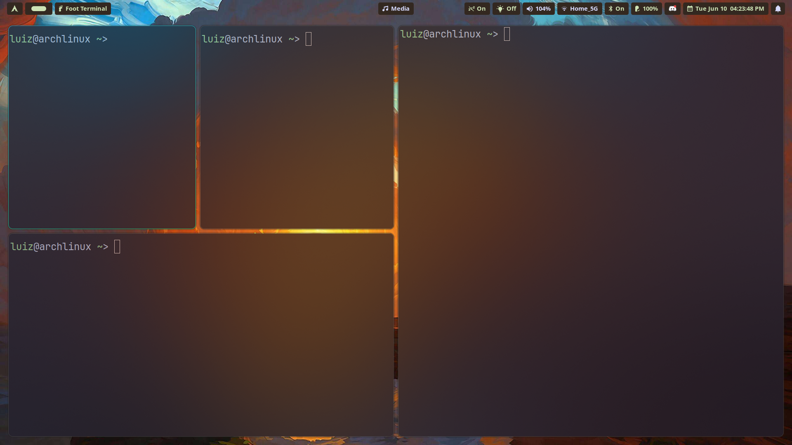

## luizfelmach/dotfiles

<p align="center">
  
</p>

```bash
sudo pacman -Syu chezmoi
```

Install the setup

```bash
chezmoi init --apply git@github.com:luizfelmach/dotfiles.git
```

```bash
chezmoi init --apply https://github.com/luizfelmach/dotfiles.git
```
